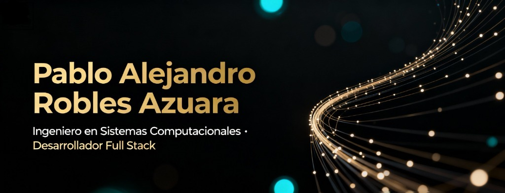

# 🚀 Portafolio Profesional 2026 - Alejandro Robles



> **Ingeniero en Sistemas Computacionales & Full Stack Developer (Laravel + React)**
>
> Un portafolio moderno, performante y escalable diseñado para demostrar habilidades técnicas avanzadas y sensibilidad estética.

## ✨ Características Principales

Este proyecto no es solo una "hoja de vida", es una demostración de ingeniería de software frontend:

*   **⚡ Performance First:** Optimizado con **Lazy Loading**, **Code Splitting** y arquitectura SPA para cargar al instante, incluso en móviles (Puntuación optimizada).
*   **🎨 UI/UX Premium:** Diseño **Glassmorphism**, efectos de neón dinámicos y animaciones fluidas con **Framer Motion**.
*   **🌌 Fondo Interactivo:** Implementación matemática de un fondo de constelaciones usando **HTML5 Canvas** y física básica, 100% responsivo (ResizeObserver).
*   **📱 Diseño Responsivo:** Adaptabilidad total "Mobile-First" con **Tailwind CSS**.
*   **🔒 Seguridad:** Configuración robusta con `.htaccess` (HSTS, Anti-Clickjacking, CSP) y sanitización de enlaces (`noopener noreferrer`).
*   **🔍 SEO Friendly:** Metadatos optimizados, soporte Open Graph (Facebook/WhatsApp/Linkedin) y Twitter Cards.

## 🛠️ Tech Stack

El proyecto está construido sobre un stack moderno y tipado:

| Categoría | Tecnologías |
| :--- | :--- |
| **Core** |    |
| **Estilos** |   |
| **Animación** |  |
| **Análisis** |  |

## 🚀 Instalación y Uso

Si deseas clonar y correr este proyecto localmente:

1.  **Clonar el repositorio:**
    ```bash
    git clone https://github.com/Alejandro-Az/Portafolio-2026.git
    cd Portafolio-2026
    ```

2.  **Instalar dependencias:**
    ```bash
    npm install
    ```

3.  **Iniciar servidor de desarrollo:**
    ```bash
    npm run dev
    ```
    Visita `http://localhost:5173` en tu navegador.

## 📦 Build para Producción

Para generar los archivos estáticos optimizados para despliegue (Hostinger, Vercel, Netlify):

```bash
npm run build
```

Esto generará una carpeta `dist/` con:
*   Minificación de JS/CSS.
*   Separación de Chunks (Code Splitting).
*   Configuración de `.htaccess` y assets estáticos.

## 📄 Estructura del Proyecto

```
src/
├── components/
│   ├── background/   # Lógica de Canvas (Constelaciones, Hexágonos)
│   ├── layout/       # Header, Footer, Wrappers
│   ├── sections/     # Hero, About, Skills, Projects, Contact
│   └── ui/           # Componentes base (Botones, Cards, Inputs)
├── data/             # Datos estáticos (Proyectos, Experiencia)
├── main.tsx          # Punto de entrada
└── App.tsx           # Router y Lazy Loading
```

## 📬 Contacto

¿Te interesa colaborar? ¡Hablemos!

*   **LinkedIn:** [Pablo Alejandro Robles Azuara](https://www.linkedin.com/in/pablo-azuara-53b295163/)
*   **GitHub:** [Alejandro-Az](https://github.com/Alejandro-Az)
*   **Email:** pabloazuara800@gmail.com

---
© 2026 Alejandro Robles. Hecho con ❤️ y mucho código.
